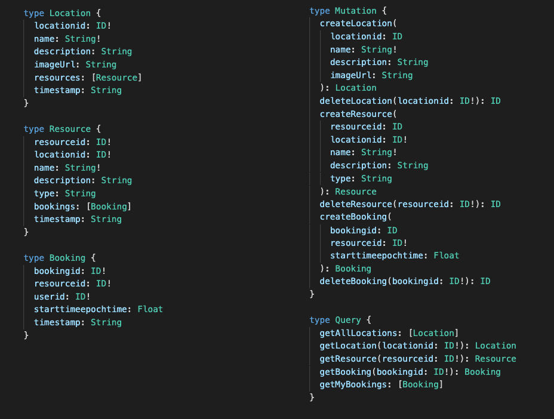
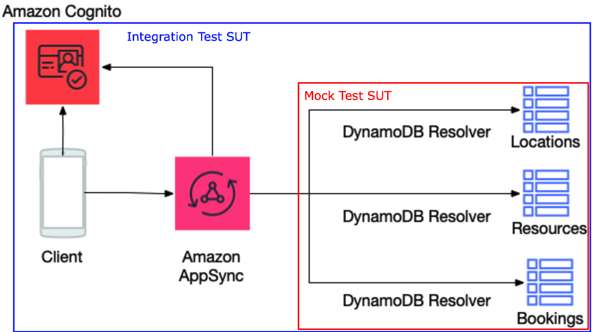
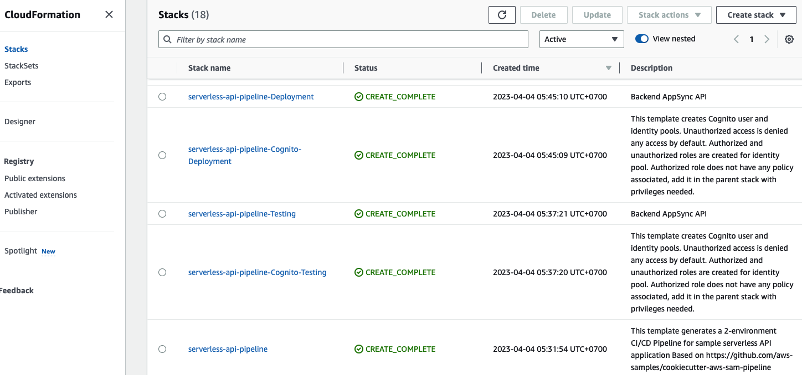

# java-appsync-sam
This is implementation of the backend GraphQL API using Java with [AWS Java SDK 2.x](https://github.com/aws/aws-sdk-java-v2) and AWS SAM. SAM had been chosen for future extensibility and ease of development of Serverless resources, such as Lambda Resolvers or Lambda Authorizers. 

## Architecture


The API uses AWS AppSync as a front door. Every new client is first required to use their credentials to authenticate with Amazon Cognito and retrieve an identity token. They must then pass this as a bearer token in the Authorization header with each subsequent request. The AWS AppSync inspects this token and allows or denies the query or mutation specified in the client request. 

Access to the data depends on the user's role and identity. All users have read access to the Locations and Resources associated with Locations. They also have read/write access to their own Bookings. Administrative users have read/write access to all Locations, Resources, and Bookings. User status (regular vs. administrative) is defined by their membership in the API administrators’ group in Cognito User Pool. 

AWS AppSync uses Amazon DynamoDB Resolvers to implement application business logic. Data is persisted in DynamoDB tables, one table per API resource. 



## System Under Test
This project contain two different scope on System Under Test (SUT), Integration test which include end to end testing, and Mock test which only test resolver using java code.



## Project structure
This project contains source code and supporting files for a serverless application that you can deploy with the AWS Serverless Application Model (AWS SAM) command-line interface (CLI). It includes the following files and folders:

```
├── src
│   ├── mapping_templates
│   ├── main
│   │   ├── java
│   │   │   └── package
│   │   │       ├── App.java
│   │   │       ├── DependencyFactory.java
│   │   │       └── Handler.java
│   │   └── resources
│   │       └── simplelogger.properties
│   └── test
│       └── java
│           └── package
│               ├── HandlerTest.java
│               └── IntegrationTest.java
├── appspec.yml
├── buildspec.yml
├── pipeline.yaml
├── template.yaml
└── testspec.yml
```

- `template.yaml` - A template that defines the application's AWS resources.
- `pipeline.yaml` - A template that defines the application's CI/CD pipeline.
- `buildspec.yml` - A template that defines the application's build process.
- `src\mapping_templates`- AWS AppSync [unit resolver mapping templates](https://docs.aws.amazon.com/appsync/latest/devguide/resolver-mapping-template-reference-overview.html)
- `tests/HandlerTest.java` - Unit tests for the API. 
- `tests/integrationTest.java` - Integration tests for the API. 
- `tests/testspec.yml` - A template that defines the API's test process.

The application uses a shared Amazon Cognito stack for authentication/authorization. You will need to create this stack and update `template.yaml` parameters section with the stack name. See next section for details

## Deploy CI/CD pipeline for the application
To create the CI/CD pipeline, we will split out code for this set of examples from the serverless-test-samples repository into a separate directory and use it as a codebase for our pipeline. 

First, navigate to the root directory of the repository. To verify it run command *basename "$PWD"* - it should return serverless-test-samples as an output. Then run the following commands:

```console
serverless-test-samples:~$ git subtree split -P java-test-samples -b java-test-samples
serverless-test-samples:~$ mkdir ../java-test-samples-cicd && cd ../java-test-samples-cicd
java-test-samples-cicd:~$ git init -b main
java-test-samples-cicd:~$ git pull ../serverless-test-samples java-test-samples
java-test-samples-cicd:~$ cd java-appsync-sam
```

To create the pipeline, you will need to run the following command:

```console
aws cloudformation create-stack --stack-name serverless-api-pipeline --template-body file://pipeline.yaml --capabilities CAPABILITY_IAM
```
The pipeline will attempt to run and will fail at the SourceCodeRepo stage as there is no code in the AWS CodeCommit yet.

***NOTE:** If you change stack name, avoid stack names longer than 25 characters. In case you need longer stack names, check comments in the pipeline.yaml and update accordingly.*

***Note:** You may need to set up AWS CodeCommit repository access for HTTPS users [using Git credentials](https://docs.aws.amazon.com/codecommit/latest/userguide/setting-up-gc.html?icmpid=docs_acc_console_connect_np) and [set up the AWS CLI Credential Helper](https://docs.aws.amazon.com/console/codecommit/connect-tc-alert-np).*

Once you have access to the code repository, navigate to python-appsync-sam folder, and, if you changed stack name, make sure that Parameters section of template.yaml is updated with the output values from the shared Amazon Cognito stack, and push code base to CodeCommit to start automated deployments:

```bash
git remote add origin <URL to AWS CodeCommit repository>
git push origin main
```

Navigate to the AWS CodePipeline in AWS Management Console and release this change if needed by clicking "Release change" button.


Note that the same Amazon Cognito stack is used in both testing and production deployment stages, the same user credentials can be used for testing and API access.

Congratulations! 

You have created a CI/CD pipeline with code repository and two environments - testing and production deployment. Each of the environments has all the resources, including their own shared Cognito stacks. The build stage automatically performs all the unit tests. Testing environment runs integration tests before stopping for a manual production deployment approval step. This is a typical behavior of the Continuous Delivery pipelines - a final human approval step is part of the deployment workflow. 

For a Continuous Deployment pipeline, you would remove the manual approval step. This way, each change in the code repository would be deployed to the production environment immediately after passing integration testing steps in the testing environment.

You can inspect the CloudFormation stacks deployed as part of the CI/CD environment in the [AWS Management Console](https://console.aws.amazon.com/cloudformation/home):



Check out testing and deployment stack outputs in the console:


Click on the CloudWatch dashboard link in the stack outputs to see the metrics emitted during the integration testing:


To use APIs in the testing and production deployment environments, you can use an HTTP (or GraphQL) client and the API endpoint URL provided in the CloudFormation stack outputs. Keep in mind that you will need to create user and authenticate using Cognito to get the access token that API uses for authentication/authorization. See the [Cognito deployment instructions](../shared/README.md) for more details on how to do it. You would use the access token as an Authorization header value while sending HTTP request to the API endpoint. 
For an example on how to create a GraphQL client, also see this [documentation article](https://docs.aws.amazon.com/appsync/latest/devguide/building-a-client-app.html).


---

## Alternative to the CI/CD - a manual deployment

***Note: This step is an alternative to the CI/CD pipeline deployment. Skip to the cleanup instructions if you deployed the pipeline already.***

As an alternative to the automated deployment using CI/CD pipeline, you may choose to deploy shared resources and application manually. Typically, you would use this approach for a quick "proof of concept" deployment, or in your individual development environment, when you want to run unit and integration tests before pushing your changes to the code repository.

To deploy the application manually, follow the instructions 

### Amazon Cognito setup
This example uses a shared stack that deploys Amazon Cognito resources. The shared stack will be deployed automatically if you use CI/CD pipeline. See [README.md](./README-Cognito.md) in this directory for the stack manual deployment instructions. After manual deployment is finished make sure to update your SAM template file `template.yaml` parameter CognitoStackName with the shared Amazon Cognito stack name. 

After the stack is created manually you will need to create user account for authentication/authorization. Deployment by CI/CD pipeline will perform following steps for you automatically. 

- Navigate to URL specified in the shared stack template outputs as CognitoLoginURL and click link "Sign Up". After filling in the new user registration form, you should receive email with verification code. Use it to confirm your account. 

- After this first step, your new user account will be able to access public data and create new bookings. To add locations and resources you will need to navigate to AWS Console, pick Amazon Cognito service, select User Pool instance that was created during this deployment, navigate to "Users and Groups", and add your user to the administrative users’ group. 

- As an alternative to the AWS Console, you can use AWS CLI to create and confirm user signup:
```bash
    aws cognito-idp sign-up --client-id <cognito user pool application client id> --username <username> --password <password> --user-attributes Name="name",Value="<username>"
    aws cognito-idp admin-confirm-sign-up --user-pool-id <cognito user pool id> --username <username> 
```

While using command line or third-party tools such as Postman to test APIs, you will need to provide Access Token in the request "Authorization" header. You can authenticate with Amazon Cognito User Pool using AWS CLI (this command is also available in AWS SAM template outputs) and use IdToken value present in the output of the command:

```bash
aws cognito-idp initiate-auth --auth-flow USER_PASSWORD_AUTH --client-id <cognito user pool application client id> --auth-parameters USERNAME=<username>,PASSWORD=<password>
```

### Application Deployment

This project is set up like a standard Java project with maven.  

You can directly call maven package to build and test the project

```
$ mvn clean package
```

To build and deploy your application for the first time, run the following in your shell:

```bash
sam build
sam deploy --guided --stack-name java-appsync-sam
```

The first command will build the source of your application. The second command will package and deploy your application to AWS, with a series of prompts:

* **Stack Name**: The name of the stack to deploy to CloudFormation. This should be unique to your account and region, and a good starting point would be something matching your project name.
* **AWS Region**: The AWS region you want to deploy your app to.
* **Parameter CognitoStackName**: The shared Amazon Cognito stack name 
* **Confirm changes before deploy**: If set to yes, any change sets will be shown to you before execution for manual review. If set to no, the AWS SAM CLI will automatically deploy application changes.
* **Allow SAM CLI IAM role creation**: Many AWS SAM templates, including this example, create AWS IAM roles required for the AWS Lambda function(s) included to access AWS services. By default, these are scoped down to minimum required permissions. To deploy an AWS CloudFormation stack which creates or modifies IAM roles, the `CAPABILITY_IAM` value for `capabilities` must be provided. If permission isn't provided through this prompt, to deploy this example, you must explicitly pass `--capabilities CAPABILITY_IAM` to the `sam deploy` command.
* **Save arguments to samconfig.toml**: If set to yes, your choices will be saved to a configuration file inside the project, so that in the future you can just re-run `sam deploy` without parameters to deploy changes to your application.

The AppSync endpoint API will be displayed in the outputs when the deployment is complete.

### Testing
Both unit tests and integration tests are defined in the `tests` folder in this project. Running maven test will invoke unit test using mock. 

```bash
mvn test
```
To running only **integration test**, add stack-name as environment variable using this command:

```bash
export TEST_APPLICATION_STACK_NAME=java-appsync-sam
```

and execute mvn with extra argument like below
```bash
mvn test -Dtest=IntegrationTest
```

Unit tests use AWS SDK to evaluate AWS AppSync resolver code. They use mock data, not the integrations with the backend services. Integration tests send GraphQL queries to the AWS AppSync endpoint and verify responses received. In addition, integration tests use WebSocket connection to the AWS AppSync for GraphQL subscriptions.


## Cleanup

To delete the sample application that you created, use the AWS CLI:

```bash
aws cloudformation delete-stack --stack-name serverless-api
```

If you created CI/CD pipeline, you will need to delete it as well, including all testing and deployment stacks created by the pipeline. Please note that actual stack names may differ in your case, depending on the pipeline stack name you used.

CI/CD pipeline stack deletion may fail if build artifact Amazon S3 bucket is not empty. In such case get bucket name using following command and looking for BuildArtifactsBucket resource's PhysicalResourceId:

```bash
aws cloudformation list-stack-resources --stack-name serverless-api-pipeline
```

Then open AWS Management Console, navigate to S3 bucket with build artifacts and empty it.

After that, delete all stacks created by the CI/CD pipeline and pipeline itself:

```bash
aws cloudformation delete-stack --stack-name serverless-api-pipeline-Testing
aws cloudformation delete-stack --stack-name serverless-api-pipeline-Cognito-Testing
aws cloudformation delete-stack --stack-name serverless-api-pipeline-Deployment
aws cloudformation delete-stack --stack-name serverless-api-pipeline-Cognito-Deployment
aws cloudformation delete-stack --stack-name serverless-api-pipeline
```
