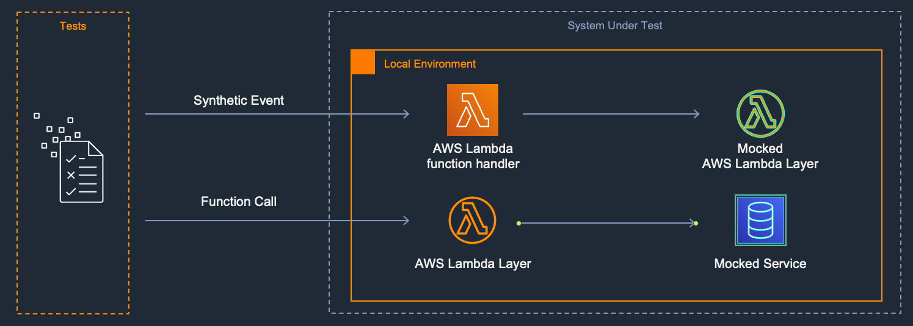

[](https://img.shields.io/badge/Python-3.9-green)
[](https://img.shields.io/badge/AWS-Lambda-blueviolet)
[](https://img.shields.io/badge/Test-Unit-blue)

# Local Lambda layer with mocks (Python)

> Test an AWS Lambda layer locally by replacing remote API calls with mocks.  

## Introduction

This project expands on the [apigw-lambda](../apigw-lambda/README.md) introductory example, and adds [Lambda Layers](https://docs.aws.amazon.com/lambda/latest/dg/invocation-layers.html) to the sample Lambda function to demonstrate test approaches.

---

## Contents
- [Local Lambda layer with mocks (Python)](#local-lambda-layer-with-mocks-python)
  - [Introduction](#introduction)
  - [Contents](#contents)
  - [System Under Test](#system-under-test)
  - [Goal](#goal)
  - [Description](#description)
  - [Limitations](#limitations)
  - [Key Files in the Project](#key-files-in-the-project)
  - [Instructions](#instructions)
  - [Other Testing](#other-testing)

[Top](#contents)

---

## System Under Test

The  System Under Test (SUT) in this pattern is Lambda layer which makes calls to other AWS services and is referenced by a Lambda function.


[Top](#contents)

---

## Goal
This pattern is intended to enable rapid development and testing of a Lambda layer that makes calls to other AWS services. Testing occurs on a local desktop environment and does not affect cloud resources. This pattern speeds development by eliminating the need to perform a build and deploy of the Lambda function and layer to the cloud between modifications of test or function code.  This pattern eliminates the need to access cloud resources to conduct tests.  Mock tests are also useful for testing failure conditions within your code, especially when mocking third party services beyond your control.

[Top](#contents)

---

## Description
In this pattern, you develop a Lambda function that references a Lambda layer. The Lambda layer makes calls to other AWS cloud services using an AWS SDK. The test is then executed in two stages: first you test the Lambda handler, and then the Lambda layer.

The Lambda handler tests create a mocked object representing the Lambda Layer. The test then directly invokes the handler function method on your local desktop, passing a synthetic event as a parameter. When the handler calls the layer, the mocked layer object returns preconfigured values. This test ensures that the lambda handler code is parsing the event correctly, calling the layer code as expected, and returning a payload in the expected format.

The Lambda layer test directly invokes the individual methods and functions in the Lambda layer. The test sets up mock objects for each external service call. During the test the calls to external cloud services are handled instead by the mocked objects, returning the pre-configured results set up by the test code. 

This pattern uses a simple test framework, with the test harness directly calling the Lambda function handlers and Lambda layer code.  No cloud resources or stack emulation are required.



[Top](#contents)

---

## Limitations
This pattern does not test IAM permissions and policies, cloud runtime environment configurations or infrastructure as code.

[Top](#contents)

---

## Key Files in the Project
  - [layer.py](src/sampleCodeLayer/python/layer.py) - Lambda layer code to test
  - [app.py](src/sampleLambda/app.py) - Lambda handler code to test
  - [template.yaml](template.yaml) - SAM script for deployment
  - [mock_test_samplecodelayer.py](tests/unit/mock_test_samplecodelayer.py) - Lambda Layer Unit test using mocks
  - [mock_test_samplelambda.py](tests/unit/mock_test_samplecodelayer.py) - Lambda Handler Unit test using mocks

[Top](#contents)

---

## Instructions

When creating unit tests, create a separate test harnesses for each layer to test its functionality, as seen in [tests/unit/mock_test_samplecodelayer.py](tests/unit/mock_test_samplecodelayer.py).  

When running in the unit tests for the Lambda function, the layer modules are not available to the Lambda function as they would be in a deployed Lambda runtime environment.  To accomodate this in the unit test code, add the path of the layers in the unit test before importing the lambda hander, as seen on lines 9:10 of [tests/unit/mock_test_samplelambda.py](tests/unit/mock_test_samplelambda.py#L9-L10):

```python
path.append("src/sampleCodeLayer/python")
path.append("src/sampleSchemaLayer/python")
from src.sampleLambda import app
```

In the unit test for the Lambda function, the layer is patched and not re-tested, as coverage is provided in the test for the layer.  As seen in [tests/unit/mock_test_samplelambda.py](tests/unit/mock_test_samplelambda.py#L20-L21) lines 20-21, you can patch the layer and mock it's return value.

To run the unit tests:

```shell

# Run from the project directory serverless-test-samples/python-test-samples/apigw-lambda-layer
# install dependencies

pip3 install virtualenv
python3 -m venv venv
source venv/bin/activate
pip3 install -r tests/requirements.txt

# run Lambda layer unit tests with mocks

python3 -m pytest -s tests/unit/mock_test_samplecodelayer.py -v

# run Lambda function unit tests with patched layer

python3 -m pytest -s tests/unit/mock_test_samplelambda.py -v
```

[Top](#contents)

---

## Other Testing

Using Lambda layers does not affect the other tests, as the layer functionality is implicitly tested with the invocation of the Lambda function. 
Therefore, integration tests and load testing is the same as seen in [apigw-lambda](../apigw-lambda)

[Top](#contents)
